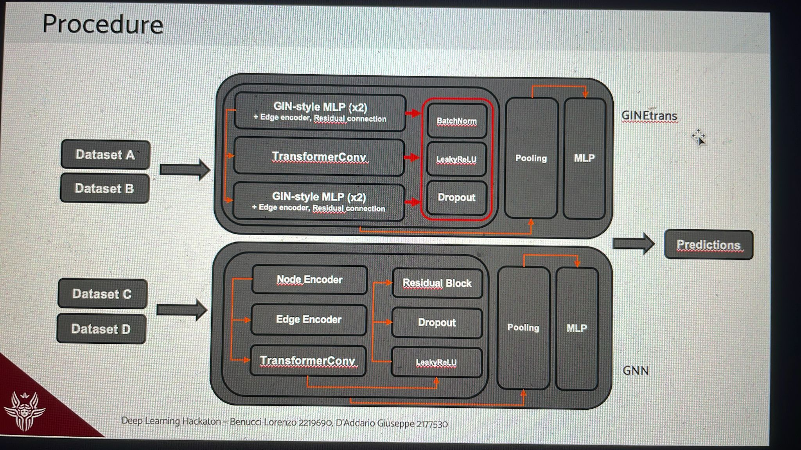

# Graph Neural Network for Graph Classification
### Deep Learning Hackaton - La Sapienza, Roma
**Giuseppe D'Addario** 2177530, **Lorenzo Benucci** 2219690.

---

This project implements a framework for graph classification tasks under different type of label noise. It features **Graph Neural Network** (GNN) architectures, including **GNNtransformers** and the advanced loss function `GCOD`.  
## Overview of the Method

Initial experiments employed basic GIN models; however, both *accuracy* and *F1 scores* remained low, indicating limited generalization capability. To address this, hybrid architectures combining **GIN** and **Transformer** layers were introduced, leading to substantial performance improvements on datasets C and D. Building on these results, a more sophisticated model was developed, integrating **GINEConv** and **Transformer** layers within a unified framework. This architecture also incorporated batch normalization, *LeakyReLU* activation, *dropout* for regularization, and a final *linear classifier*.


<p align="center">
  
</p>

## Models' details

Two distinct strategies are proposed:

* `GNN` model for C and D datasets
    
* `GINE + transformer` model for A and B datasets
---


*   **GNN** [ *N.E → E.E. → TransConv → LeakyReLU → Dropout → Residual → Pooling → MLP*]
    * **GINConvE** layers followed by batch normalization and LeakyReLU activation, capturing local neighborhood structures.
      After transformer, there are still two of these layers to refine the representation of graphs.
    * **Mean pooling** layer to aggregate node embeddings.
    * `TransformerConvBlock`, which forms the core of the model, is a graph convolutional layer based on the transformer architecture with a self-attention mechanism. This design enables it to capture complex, long-range dependencies between nodes in the graph, allowing the network to model global context and interactions beyond immediate neighbors. As a result, it significantly enhances the expressiveness of the node representations.

    * **Dropout** is used to reduce overfitting by randomly deactivating neurons during training, preventing the model from relying too heavily on specific activations and improving generalization.
    * **MLP** with *Leaky ReLU* mapping the graph embedding to the output classes.
    * **Residual connections** help stabilize training by preserving the original input across layers, allowing gradients to flow better.


*   **GINE + TRANSFORMER** [ *2xGIN → B.L.D. → TransConv → B.L.D. → 2xGIN → B.L.D. → Pooling → MLP*]

    * **GINE** The GINE layers are fundamental for local neighborhood aggregation, capturing structural patterns around each node. Their strong discriminative power ensures that subtle topological differences across graphs are effectively encoded into the node and edge embeddings.
    * **B.L.D.** (***B**atchNorm-**L**eakyReLU-**D**ropout*) 
      * **BatchNorm** normalizes input embeddings increasing stability and training speed.
      * **Leaky ReLU** allows a small, non-zero gradient when the input is negative, helping to avoid the "dying neuron" problem.
      * **Dropout** for mitigating overfitting.

    * A **TransformerConvE** layer with edge-aware attention mechanisms, capturing long-range dependencies across the graph. Includes residual connection and batch normalization.
 
    * **Residual Connections** as before.
    * **Pooling** Aggregates node embeddings into a fixed-size vector, preparing the graph representation for the classifier.
    * **MLP** for classification.


## <u>GCOD</u>
To mitigate overfitting due to noise, we found that using the **GCOD** loss instead of the standard *Cross-Entropy* significantly improves performance.

*   **How it works:**
    1.  Maintains a learnable parameter `u` for each training sample, representing the model's confidence that the sample is "clean".
    2.  Computes class `centroids` based on embeddings of (presumably) cleaner samples.
    3.  Calculates `soft_labels` based on embedding similarity to centroids.
    4.  **L1 (Classification Loss):** A modified cross-entropy where logits are adjusted by `u` and true labels, and the target is the `soft_label`.
    5.  **L2 (u-Update Loss):** Encourages `u` to align with model predictions vs. true labels.
    6.  **L3 (Regularization Loss):** A DKL-based regularizer using `u` and model's confidence in the true class, weighted by `(1 - atrain_overall_accuracy)`.
*   `atrain_overall_accuracy`: Global accuracy on the training set, used to modulate GCOD's behavior.


## Procedure

1. **Preprocessing Data:**
   - The datasets are loaded and preprocessed into graph structures.
   - Graphs are represented by node features, edge indices, and edge attributes.


2. **Training:**
   - The model is randomly initialized and starts the training. The convergence of the accuracy and loss is noted around 80-100 epochs training; going on would mean overfitting on the train set.
   - For training on a dataset:
     ```bash
     python main.py --train_path ../A/train.json.gz --test_path ../A/test.json.gz --num_epochs 100
     ```
   - the trained models' weights are saved. F1 score metric is used to update, and choose, the best model.

3. **Inference and Predictions:**
   - The two trained models can be used to predict on the test sets.
   - To make test set labelling with predictions:
     ```bash
     python main.py --test_path ../A/test.json.gz 
     ```

## Code Structure

The script includes a `requirements.txt` containing all dependencies needed to run the code. Other files are organized as below:

- **`main.py`:** The main script for training, evaluating, and predicting with the model.
- **`loadData.py`:** Handles data loading, preprocessing, and dataset preparation.
- **`conv.py`:** Implements convolutional layers and custom graph convolution operations.
- **`models.py`:** Defines the architecture of the neural network models used in the project.
- **`train.py`:** Script and functions responsible for training the model.
- **`evaluation.py`:** Provides evaluation methods and metrics to assess model performance.
- **`loss.py`:** Contains the loss functions used for model training.
- **`statistics.py`:** Contains functions to compute and report statistical metrics and performance summaries.

---


